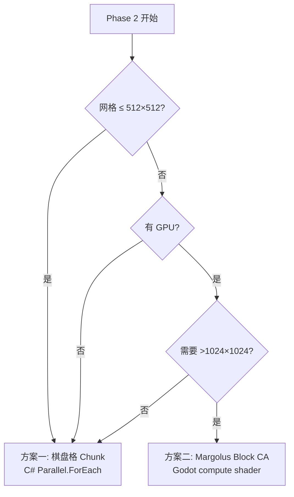

> 文档路径：`docs/algorithms/parallel-update-strategies.md`
> 运行时版本：通用（Phase 2 Godot+C# 适用）
> 最近更新：2026-06-06 (UTC+8)

# 像素更新并行化策略

## 1. 问题背景

当前 Python 原型使用纯串行单缓冲遍历（`core/grid.py:54-96`）：自底向上逐行、每帧左右交替、`is_dirty` 标记防重复更新。在 128×128 网格上够用，但 Phase 2 目标网格 512×512+（262144 像素）时，单线程 per-frame 遍历会成为瓶颈。

核心难点：**单缓冲 in-place 更新天然不适合并行**——像素 A 的移动可能写入像素 B 的位置，而 B 可能正在被另一个线程处理。

本文档整理三种经过实际项目验证的并行方案，供 Phase 2 迁移时选型。

---

## 2. 方案一：Noita 棋盘格 Chunk（CPU 多线程）

### 来源

- [Petri Purho GDC 2019: Exploring the Tech and Design of Noita](https://www.youtube.com/watch?v=prXuyMCgbTc)
- [macuyiko: Exploration of CA Game Systems Part 4](https://blog.macuyiko.com/post/2020/an-exploration-of-cellular-automata-and-graph-based-game-systems-part-4.html)
- [80.lv: Noita 技术解析](https://80.lv/articles/noita-a-game-based-on-falling-sand-simulation)

### 原理

世界分为 **64×64 chunk**。每帧分 **4 个 pass** 更新，每个 pass 选一组棋盘格分布的 chunk（互不相邻），各线程独立处理各自的 chunk。

```
Pass 1:          Pass 2:          Pass 3:          Pass 4:
■ □ ■ □          □ ■ □ ■          □ □ □ □          □ □ □ □
□ □ □ □          □ □ □ □          ■ □ ■ □          □ ■ □ ■
■ □ ■ □          □ ■ □ ■          □ □ □ □          □ □ □ □
□ □ □ □          □ □ □ □          ■ □ ■ □          □ ■ □ ■

（■ = 本 pass 更新的 chunk，□ = 不动）
```

每个被更新 chunk 的**写域 = 本 chunk 64×64 + 四个正方向各 32px 的十字形**（Petri 原话："the pixels inside the chunks are allowed to move within that 64×64 area **plus 32 pixels in each cardinal direction**"——不含对角扩展）。同一 pass 中被选 chunk 之间隔一个 chunk（64px 缝隙），两侧写域 32+32 恰好相接不重叠 → **写竞争为零 → 无需锁或原子操作**。等效结论：单帧像素位移上限 32px（"We guarantee that no pixel can be moved more than 32 pixels away"）。

> 2026-06-06 已对 80.lv / macuyiko 原文逐字核验上述两句（见 `docs/reference/noita-deep-dive.md` §7 抽查记录）。
> **确定性 caveat**：写域相接处的**读**是否越界（A chunk 边缘像素的邻居检查读到 C chunk 正在写的格子）Noita 未公开——若越界则存在 benign race，结果依赖线程时序。要做位级确定性并行，需显式"域边夹断"规则（边缘交互推迟到该缝隙归属 chunk 的 pass 处理，最坏落到下一帧对应 pass），详见 `docs/proposals/2026-06-06-deterministic-parallel-and-netcode.md`。
> **工程偏离（2026-06-06 评审 B2）**：在"每 chunk 只扫描自己像素"的所有权语义下，照抄十字写域会在 chunk 角落产生**永久对角死锁**（如 (63,63)→(64,64) 不在任何会扫描该像素的 chunk 写域内），且每 pass 有 25% 面积（32×32 角块）无人可写。我们的实现采用**正方形写域 `[chunk−32, chunk+96)²`**——穷举验证同 pass 两两不相交且恰好密铺全平面，交换律保持。本节 Noita 原话保留作调研记录，工程以提案 §2.2 条件① 为准。

### 关键约束

- **每帧像素最大位移 ≤ 32px**（硬保证，Noita 的核心不变量）
- 每个 chunk 维护 **dirty rect**，只更新有变化的区域
- chunk 远离玩家时可降频或休眠
- **双层 chunk 结构**：64×64 是模拟 chunk；**流式/落盘单位是 512×512**（内存驻留约 12 个，社区 datamine）——两者不要混用

### 伪代码

```
for pass_id in [0, 1, 2, 3]:
    active_chunks = select_checkerboard(pass_id)
    parallel_for chunk in active_chunks:
        # 每个线程独立处理一个 chunk
        # 像素可移动到 chunk 外最多 32px
        for y in chunk.dirty_rect (bottom to top):
            for x in chunk.dirty_rect (alternating direction):
                if cell is air or dirty: skip
                target = try_move(x, y)
                if target and within_32px_of_chunk:
                    swap(x, y, target)
                    mark_dirty(target)
                check_reactions(x, y)
```

### 优缺点

| 优点 | 缺点 |
|------|------|
| 和当前串行算法**语义完全兼容** | CPU 绑定，核数有限（4-8 线程） |
| 无锁无原子，实现相对简单 | 4 pass 有同步开销（每 pass 后需 barrier） |
| dirty rect 优化天然集成 | 32px 位移限制需要在 rules 层强制执行 |
| C# `Parallel.ForEach` + `Span<T>` 友好 | chunk 边界像素的反应检查需要特殊处理 |
| Noita 验证过的成熟方案 | — |

### 适用场景

**Phase 2 首选方案**。和当前串行代码改动最小：只需把单次全量遍历拆成 4 pass chunk 遍历，chunk 内逻辑不变。

---

## 3. 方案二：Margolus 邻域 Block CA（GPU 并行）

> 注意：**这不是 Noita 的方案**（Noita 用 §2 的棋盘格 chunk，已核验）。Margolus 是学术/GPU 路线。其附带优点：2×2 块不重叠 + 纯 LUT → **天然位级确定性**，对联机同步友好（见确定性提案）。

### 来源

- [GPU-Falling-Sand-CA](https://github.com/GelamiSalami/GPU-Falling-Sand-CA)（HLSL compute shader 实现）
- [Wikipedia: Block cellular automaton](https://en.wikipedia.org/wiki/Block_cellular_automaton)
- [falling-turnip](https://github.com/tranma/falling-sand-game)（Haskell + Repa 并行数组实现）
- [Probabilistic CA for Granular Media](https://arxiv.org/pdf/2008.06341)

### 原理

完全不同的更新模型——不是逐像素移动，而是把世界分为 **2×2 不重叠块**，每个块内 4 个像素作为整体通过**查找表**映射到下一状态。

**交替偏移**：偶数帧用 `(0,0)` 对齐的 2×2 块，奇数帧偏移 `(1,1)` 对齐。两帧交替使得像素可以跨越块边界移动。

```
偶数帧分块:               奇数帧分块（偏移 1,1）:
┌──┬──┬──┬──┐             ┬──┬──┬──┬─
│01│23│45│67│            ─┼──┼──┼──┼─
│89│AB│CD│EF│             │12│34│56│7
├──┼──┼──┼──┤            ─┼──┼──┼──┼─
│..│..│..│..│             │9A│BC│DE│F
└──┴──┴──┴──┘             ┴──┴──┴──┴─
```

### 重力规则（2×2 块内查找表）

每个 2×2 块有 4 个格子，每格可以是不同材质或空气。规则表定义输入→输出映射：

```
输入          输出          含义
[S .]  →  [. .]       沙子自由下落
[. .]     [S .]

[S S]  →  [. .]       两粒沙同时下落
[. .]     [S S]

[S .]  →  [. S]       下方被挡，斜向滑落
[X .]     [X .]

[W W]  →  [W .]       液体横向扩散（概率性）
[. .]     [. W]       （S=Sand, W=Water, X=Solid, .=Air）
```

规则表实际编码为 `uint16 → uint16` 的 LUT（4 格 × 每格用若干 bit 编码材质类型）。

### 液体处理

基础 Margolus 只支持块内移动（1 格/帧），液体横向流动需要额外技巧：
- **多 pass**：每帧跑 2-4 次 Margolus 更新（不同偏移），等效加速横向传播
- **概率规则**：液体在块内随机选横向方向，统计上均匀扩散
- **密度排序**：块内按密度对 4 个像素排序——重的沉底，轻的浮顶

### 在 GPU 上的实现

```hlsl
// Compute shader — 每个线程处理一个 2×2 块
[numthreads(8, 8, 1)]
void CSMain(uint3 id : SV_DispatchThreadID) {
    int2 block_origin = id.xy * 2 + frame_offset;  // 偶/奇帧偏移
    
    // 读取 2×2 块的 4 个像素
    uint4 block = read_block(block_origin);
    
    // 查找表变换
    uint4 new_block = rule_lut[encode(block)];
    
    // 写回
    write_block(block_origin, new_block);
}
```

### 优缺点

| 优点 | 缺点 |
|------|------|
| **天然并行**——每个 2×2 块独立，GPU 数万线程 | 规则表达力弱：像素每帧只能在 2×2 内移动 |
| 自动守恒（块内粒子数不变） | 液体横向流动需要多 pass 或概率规则 |
| 规则全在 LUT 里，运行时零分支 | 材质反应系统需要额外 pass |
| 爆炸等大规模操作几乎免费 | 调试困难（GPU 上看不到中间状态） |
| 性能天花板最高（16M+ 像素实时） | 和当前串行算法语义不兼容，需要重写 |

### 适用场景

**Phase 2+ 可选升级路线**。如果 CPU 棋盘格方案性能不够（网格 >1024×1024），再考虑切 GPU。需要重写核心更新逻辑。

---

## 4. 方案三：混合方案（Chunk 调度 + 块内 Margolus）

### 来源

- [meatbatgames: GPU Falling Sand](https://meatbatgames.com/blog/falling-sand-gpu/)

### 原理

结合方案一和方案二：
- **Chunk 级别**：用棋盘格调度决定哪些 chunk 本 pass 更新（与 Noita 相同）
- **Chunk 内部**：用 Margolus 2×2 块规则在 compute shader 里并行更新
- **反应检查**：作为独立 pass 在块更新后执行

### 适用场景

最复杂但性能最好。适合目标网格 2048×2048+ 的场景。Phase 2 不建议一步到位——先用方案一，遇到瓶颈再考虑。

---

## 5. 选型建议



| 阶段 | 方案 | 改动量 |
|------|------|--------|
| Phase 1 Python 原型 | **M0.5 起切换为单线程 4-pass/chunk 调度**（语义与 Phase 2 对齐，见确定性提案 §5；2026-06-06 更新，取代原"保持串行"） | grid.update() 拆 pass，不并行 |
| Phase 2 Godot+C# 初版 | **棋盘格 Chunk**（方案一） | grid.update() 拆成 4 pass + chunk 管理器 |
| Phase 2+ 性能优化（如需） | **Margolus Block CA**（方案二） | 核心更新逻辑重写为 compute shader |

### Phase 2 迁移时的具体改动点

从当前串行 `CellGrid.update()` 迁移到棋盘格 Chunk：

1. **新增 `ChunkManager`**：管理 chunk 数组、dirty rect、休眠状态
2. **修改 `CellGrid.update()`**：从单次全量遍历改为 4 pass 循环，每 pass 调用 `ChunkManager.get_active_chunks(pass_id)`
3. **修改 `rules.py`**：`try_move()` 的返回值需要限制在 32px 以内（当前最大位移就是 1px，所以实际上不需要改）
4. **chunk 边界反应**：`_check_reactions()` 越出自家写域的邻居检查本 pass 跳过，由该缝隙归属 chunk 的 pass 结算（最坏落到下一帧对应 pass——确定性提案评审 M2 口径）

---

## 6. 参考资料

| 资料 | 内容 |
|------|------|
| [Petri Purho GDC 2019](https://www.youtube.com/watch?v=prXuyMCgbTc) | Noita 棋盘格 4-pass 方案原始讲解 |
| [macuyiko blog Part 4](https://blog.macuyiko.com/post/2020/an-exploration-of-cellular-automata-and-graph-based-game-systems-part-4.html) | 最详细的 Noita 多线程技术复盘 |
| [GPU-Falling-Sand-CA](https://github.com/GelamiSalami/GPU-Falling-Sand-CA) | Margolus Block CA 的 HLSL compute shader 实现 |
| [falling-turnip](https://github.com/tranma/falling-sand-game) | Margolus 邻域落沙的 Haskell 并行实现，含规则定义 |
| [Wikipedia: Block cellular automaton](https://en.wikipedia.org/wiki/Block_cellular_automaton) | Margolus 邻域的理论基础 |
| [Probabilistic CA for Granular Media](https://arxiv.org/pdf/2008.06341) | 概率 CA + Margolus 的学术参考 |
| [meatbatgames: GPU Falling Sand](https://meatbatgames.com/blog/falling-sand-gpu/) | 混合方案的实践经验 |
