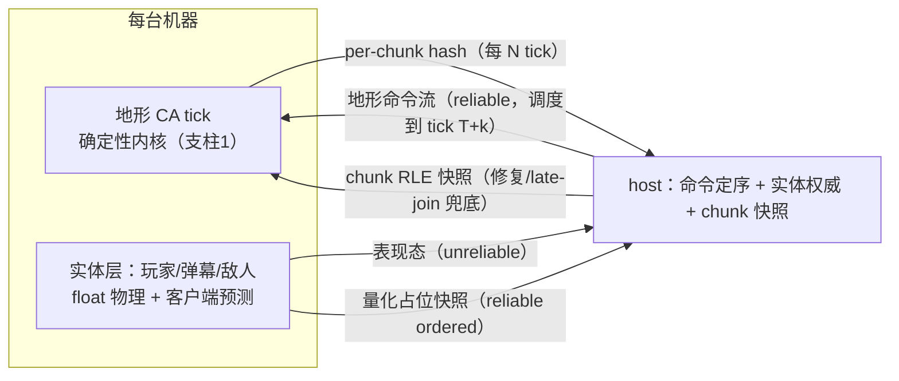

> 文档路径：`docs/overview/architecture.md`
> 运行时版本：Python 3.x（Phase 1）→ Godot 4.5 + C#（Phase 2+）
> 最近更新：2026-06-14 (UTC+8)

# fallingTest 架构总览（导航入口）

> 本文是**全景地图**：三阶段、里程碑、最终架构、代码地图、文档指针一篇看全。
> 细节不在这里——每节末尾给出权威出处文档。新会话开局先读这篇 + `CHANGELOG.md` 顶部。

---

## 1. 一句话定位

**最终目标**：东方 Project 同人**横版动作游戏**，用像素物理（Noita 式落沙元胞自动机）实现复杂地形交互与打击感。

技术赌注：自研一个**确定性、可联机、可多线程**的像素物理内核，上面挂东方横版弹幕动作的实体层。

## 2. 三阶段

```mermaid
flowchart LR
    P1["Phase 1: Python 原型<br/>prototype/<br/>验证 CA 算法 + 性能 + 确定性"]
    P2["Phase 2: Godot + C# 迁移<br/>nodes/<br/>引擎渲染 + 多线程 + 刚体桥接 + 联机"]
    P3["Phase 3: 游戏层<br/>nodes/<br/>横版动作 + 东方弹幕 + 打击感"]
    P1 -->|算法一对一移植<br/>渲染层重写| P2 --> P3
    style P1 fill:#2d4a2d
```

| | Phase 1（当前） | Phase 2 | Phase 3 |
|---|---|---|---|
| 做 | CA 算法 / 材质规则 / 反应表 / 基础渲染 / benchmark | 引擎渲染 / 刚体桥接 / 角色控制 / 多线程 / 联机 | 弹幕 / 关卡 / UI / 音效 / 打击感 |
| 不做 | 刚体 / 角色 / UI / 关卡 | —— | —— |

> 出处：`CLAUDE.md` §1。迁移边界细则见 `CLAUDE.md` §5.4。

## 3. 里程碑路线（贯穿 Phase 1→2，提案 §5）

| 里程碑 | 内容 | 阶段 | 状态 |
|---|---|---|---|
| **M0** | 确定性地基：counter RNG / 录放 / 分层 hash / 整数化 | Phase 1 | ✅ |
| **M0.5** | 单线程 4-pass chunk 调度**语义**原型（不并行，只锁语义） | Phase 1 | ✅ |
| **玩法队列** | dispersion → velocity → fire → inertia → 粒子+爆炸 | Phase 1 | 🔄 dispersion ✅ |
| **M1** | M0.5 语义一对一移植到 C# + 真多线程（线程池跑无关 chunk） | Phase 2 | ⬜ |
| **M2** | 联机 spike：地形 lockstep + 实体状态同步 + PvP 场景验证 | Phase 2 末 | ⬜ |
| **M3** | 正式 netcode：ENet/GodotSteam、save-load、desync report、late-join | Phase 2/3 | ⬜ |

**当前位置**：M0.5 完成，玩法队列第 1 项 dispersion 已交付。下一项 **velocity 8.8 定点积分**——这是写域契约第一次真正承压（一帧多格移动逼近 32px margin）。

> 出处：`docs/proposals/2026-06-06-deterministic-parallel-and-netcode.md` §5。当前进度见 `CHANGELOG.md` + 最新 `docs/sessions/`。

## 4. Phase 1 玩法队列（deep-dive §5.2 Gap 表，按性价比）

| # | 项 | 优先级 | 预估 | 状态 |
|---|---|---|---|---|
| 1 | 液体 dispersion rate | P0 | 半天 | ✅ |
| 2 | velocity / 重力积分（一帧多格，≤32px 定点） | **P0** | 1 天 | ← 下一个 |
| 3 | CA↔粒子双轨（水花/血溅/碎屑） | P0 | 2–3 天 | ⬜ |
| 4 | fire 系统（spec v2 已就绪，Noita 式） | P1 | 半天+实施 | ⬜ |
| 5 | 粉末 inertia / free-falling | P1 | 1 天 | ⬜ |
| 6 | 密度交换速率控制 | P1 | 半天 | ⬜ |
| 7 | 爆炸（径向破坏 + 粒子弹射） | P1 | 2 天 | ⬜ 打击感里程碑 demo |
| 8 | chunk + per-chunk dirty rect（**不做 per-pixel static**） | P2 | benchmark 后 | ⬜ |

> 出处：`docs/reference/noita-deep-dive.md` §5.2、§6。fire 设计见 `docs/superpowers/specs/2026-05-26-fire-system-design.md`（v2，Noita 式）。

## 5. 最终架构：两大支柱

### 支柱 1 — 确定性并行 CA 内核

**核心论证**（提案 §2.2）：三个条件 ⇒ 任意线程数位级一致——
1. **写域互斥**：每 chunk 拥有正方形写域 `[chunk−32, chunk+96)²`，同 pass 内两两不相交 → 无锁无原子。
2. **读域夹断**：越出写域的邻居交互推迟到那条缝归属 chunk 的 pass。
3. **counter-based RNG**：随机数 = `(seed,tick,pass,x,y,salt,attempt)` 的纯函数，不依赖调用顺序。

M0.5 已在 Python **单线程**锁死这套语义（4-pass 棋盘 + 世代戳）。Phase 2 (M1) 只换语言 + 加线程池，**不再动语义**——避免同时换语言+换调度+换并行的三重风险。

确定性靠 **D1–D10 工程契约**约束（提案 §3）：sim 内核纯整数、固定遍历顺序、缓存只省工不改果、分层 state hash、sim 与表现层硬隔离……

### 支柱 2 — 联机架构 B：双层 + 双通道

用户已拍板目标形态：**coop + 小规模 PvP**。

- **地形层**：各机同 tick 跑确定性 CA；扰动（挖掘/爆炸/放液体）封装成参数化命令由 host 定序广播 → **地形带宽 ≈0**。
- **实体层**：传统状态同步 + 客户端预测 + 插值（东方 action 手感要求）。
- **铁律**：实体写地形必须走命令、禁止直改；**量化边界 = 确定性边界**（进入地形 tick 的数据先量化为整数）；客户端只预测实体层、不预测地形写入。
- **退路 / 升级**：M2 若跨机确定性困难 → 退**路线 C**（chunk diff 流，复用同套 RLE 基础设施）；若实体层确定性意外容易（**东方弹幕本就是确定性 pattern**）→ 升**路线 A**（实体也进 lockstep，replay 全免费）。

> 出处：提案 §2（确定性论证）、§3（D1–D10）、§4（联机三路线对比 + 推荐 B）。背景调研：`docs/reference/noita-multiplayer-and-determinism.md`。

## 6. 代码地图（prototype/）

| 文件 | 职责 | 关键锚点 |
|---|---|---|
| `core/cell.py` | 像素存储常量：STRIDE=5，`[type_id, velocity, lifetime, flags, updated_at]` | 单缓冲平铺 `list[int]` |
| `core/grid.py` | 世界 + `update()` 主循环（4-pass chunk 扫描 + lifetime decay + 反应） | `update()` / `_check_reactions()` |
| `core/chunks.py` | chunk 几何 + 4-pass parity + 正方形写域（纯几何） | `ChunkLayout` |
| `core/rules.py` | 运动规则：powder/liquid/gas/energy + `_probe_side`（dispersion 探测） | `try_move()` / `_probe_side()` |
| `core/material.py` | TOML 材质加载，`MaterialDef`（含 density/dispersion/tags） | `MaterialRegistry` |
| `core/reaction.py` | TOML 反应表（tag 展开 + u32 阈值 + 对称注册） | `ReactionTable` |
| `core/rng.py` | counter RNG（SquirrelNoise5 + 7 元 key） | `rng_u32()` |
| `core/ops.py` + `replay.py` | 共享写入路径 + JSONL 录制/回放 | `apply_brush()` |
| `data/materials.toml` | **材质 + 反应表唯一真源** | — |
| `benchmark.py` | 双尺寸性能基准 | — |

材质五大类运动优先级（`rules.py`）：
- **Powder**：下 → 斜下
- **Liquid**：下 → 斜下 → 横向（dispersion 探测最远空格）
- **Gas**：上 → 斜上 → 横向（液体镜像）
- **Energy**：自定义扩散（火占位：随机向上 + 概率停留）

> 燃烧**不走反应表**（专用 burn pass，fire spec v2）；反应表唯一真源 = `materials.toml`。

## 7. 文档导航（三层分工）

| 层 | 路径 | 何时看 |
|---|---|---|
| **算法层** | `docs/algorithms/` `docs/materials/` | 改模拟逻辑前 / 新增材质前 |
| **工程层** | `docs/overview/`（本篇）`docs/perf/` `docs/reference/` | 架构 / 性能 / 迁移前 |
| **决策层** | `docs/proposals/` `docs/superpowers/` `docs/sessions/` | 评估方案 / 恢复上下文 |

关键文档速查：
- 路线 + 确定性 + 联机：`docs/proposals/2026-06-06-deterministic-parallel-and-netcode.md`
- Noita 技术对照 + Gap 队列：`docs/reference/noita-deep-dive.md`
- 联机调研：`docs/reference/noita-multiplayer-and-determinism.md`
- 性能基线：`docs/perf/baseline.md`
- 工作账本 / 会话账本：`docs/CHANGELOG.md` / `docs/sessions/`

## 8. 关键不变量速查（改 sim 代码前必读）

1. **单缓冲 in-place**：移动 = `swap()` 两格，无双缓冲。
2. **世代戳 `updated_at`**：扫描遇当前帧戳即跳过，防同帧二动（跨缝移入者）。
3. **写域契约**：移动目标必须在 `_write_rect` 内，越界 break（dispersion/velocity 探测靠它截断）。
4. **纯整数 sim**：density 整数、概率 u32 阈值、velocity 定点；float 禁入 CA 状态与比较（D1）。
5. **counter RNG**：sim 禁 `import random`（有防回归断言）；随机 = 坐标纯函数（D2）。
6. **语义变更作废 hash**：任何改变模拟行为的改动都使既往 hash 序列作废（录放/同 seed 等价测试不受影响）。
