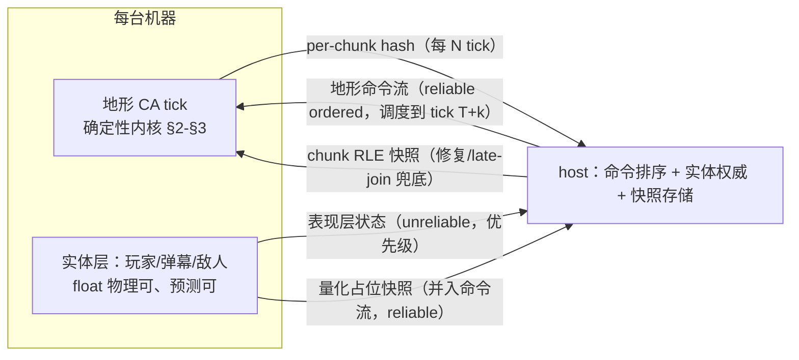

> 文档路径：`docs/proposals/2026-06-06-deterministic-parallel-and-netcode.md`
> 运行时版本：Phase 1 Python 原型 → Phase 2 Godot 4.5 + C#
> 最近更新：2026-06-06 (UTC+8)
> **Status**: Trial（2026-06-06 用户裁决通过，M0 批准执行——见 §7 裁决记录）

# 确定性并行模拟 + 联机网络策略

调研依据：`docs/reference/noita-multiplayer-and-determinism.md`（下称"调研报告"）、`docs/reference/noita-deep-dive.md`、`docs/algorithms/parallel-update-strategies.md`。

## 1. 要回答的两个问题

1. **并行**：棋盘格多 chunk 并行更新，会因为线程先后顺序产生不确定性吗？
2. **联机**：要做联机游戏，模拟同步走哪条路线？

一句话答案：

1. **不会——只要满足三个条件**（写域互斥、读域夹断、counter-based RNG）。线程时序只在存在数据竞争或顺序依赖时才影响结果；棋盘格方案恰好可以构造成"无竞争且无顺序依赖"。Noita 自己（大概率）没做到确定性，是因为单机游戏不需要，不是因为做不到。
2. **推荐"地形 lockstep + 实体状态同步"双层混合**（路线 B），用 NEW 式 chunk 快照做修复/late-join 兜底通道；确定性投资从 Phase 1 现在就开始（M0，约 2 天），它同时服务联机、回放、调试、CI 回归四件事。

---

## 2. 并行 ≠ 不确定：论证

### 2.1 不确定性的三个真实来源

| 来源 | 机制 | 例 |
|---|---|---|
| 读写竞争 | 线程 A 读的格子正被线程 B 写，结果取决于谁先到 | chunk 边缘像素的邻居检查越过写域 |
| RNG 顺序依赖 | 全局顺序流 RNG（`random.random()`）的第 N 个数取决于"谁先取"，线程调度改变取数顺序 | `rules.py` 当前所有 `random.*` 调用 |
| 归约/浮点顺序 | 并行求和等归约的结合顺序不定；浮点加法不满足结合律 | 温度场全局扩散（若做） |

**线程调度本身不产生不确定性**——它只是放大器。消灭这三个来源，任意线程数/调度下结果位级一致。

### 2.2 确定性棋盘格（核心论证）

基于已核验的 Noita 方案（4-pass、64×64 chunk、写域 = chunk + 四正方向 32px 十字）：

1. **pass 间有 barrier** → 每个 pass 的起始世界状态是确定的快照。
2. **pass 内写域互斥**：同 pass 活跃 chunk 的**正方形写域 `[chunk−32, chunk+96)²` 两两不相交且恰好密铺全平面**（穷举验证，评审 B2）→ 任何格子每 pass 恰被一个 chunk 可写 → pass 终态 = 各 chunk 更新结果的无交并集，**与 chunk 执行顺序、线程数、调度完全无关**。
3. 还差三个条件，缺一不可：

   - **条件 ①（正方形写域 + 读域夹断 + 所有权制）**：每个活跃 chunk 的**写域 = 正方形 `[chunk−32, chunk+96)²`**（∞-norm 32px 位移的可达集）。同 pass 活跃方块两两不相交且恰好密铺全平面（穷举验证）。读域 ⊆ 自家方块：方块边界外的邻居检查本 pass 跳过，由该缝隙归属 chunk 的 pass 结算——**最坏落到下一帧的对应 pass**（评审 M2 修正口径，仍不可感知）。**所有权制**：每 chunk 只扫描自己 64×64 内的像素；世代戳在**移动/变换时**盖（非扫描时）。
     ⚠️ **工程偏离 Noita（评审 B2）**：照抄 Petri 原话的"十字（cardinal）写域"会在 chunk 角落产生**永久对角死锁**——(63,63)→(64,64) 不在任何会扫描该像素的 chunk 写域内，且每 pass 有 25% 面积（32×32 角块）无人可写、与未来速度积分的斜向路径冲突。正方形域修复全部三点且不削弱交换律。调研文档保留 Noita 原话作记录，工程实现以本条为准。
   - **条件 ②（counter-based RNG）**：随机数改用无状态哈希，**完整 key 为 `rand = hash(world_seed, tick, pass_id, x, y, decision_salt, attempt_index)`**（SquirrelNoise5 路线）。`decision_salt` 区分决策点（滑落方向/反应判定/火焰生成…）；`attempt_index` 是同一决策点在同 tick 内的确定性循环计数（速度积分多次子步、火焰生成对多邻居逐个尝试、反应表多候选）——**缺它会得到"确定但强相关"的随机性**：同帧同格多次掷骰返回同值，子像素概率取整被系统性偏置；`pass_id` 防止同格在不同 pass 被处理时 key 撞车（Phase 1 串行取 0）。每个随机决策由 key 唯一确定，与取数顺序、线程划分无关。**这是当前原型最大的确定性漏洞**：`prototype/core/rules.py:3` 起的全局 `random` 流（`random.shuffle` 选斜下方向、`random.random()` 反应概率）在任何并行方案下都会破坏确定性，串行下也使"同 seed 复现"依赖完整调用序列。
   - **条件 ③（固定遍历）**：chunk 内扫描顺序固定（自底向上 + 帧奇偶交替——`prototype/core/grid.py:62-64` 已满足）；pass 顺序固定（0,1,2,3 或按帧确定性轮换）；跨 pass 移动进来的像素用世代计数器（sandspiel 的 `clock` 方案）防同帧二次更新，判定本身确定。

4. **结论**：满足 ①②③ 的 4-pass 棋盘格，对任意线程数（含 1）位级确定。**单线程跑和 8 线程跑逐字节相同**——这也给了完美的测试谓词（§5 M1）。

> 备选：Margolus block CA（`docs/algorithms/parallel-update-strategies.md` §3）天然满足条件①③（2×2 块不重叠、固定交替分块）；条件②的 keyed RNG **照样需要**（其液体规则是概率性的，评审 n2）。仍是确定性最容易的路线，但表达力弱、与现有规则不兼容，维持"Phase 2+ GPU 备选"定位不变。

### 2.3 顺序账本：落沙结果本来就依赖更新顺序，我们如何处理

**前提澄清**：单缓冲落沙的结果是更新顺序的函数——自底向上才有沙柱整帧连贯下落、左右交替才消除横向偏置、"先处理者得"才能裁决目标格冲突。顺序是算法语义的一部分，**不可消除、也不需要消除**。确定性的要求是：顺序必须是 `(seed, frame, 坐标)` 的纯函数，与线程调度/挂钟/容器枚举序无关。逐项钉死：

| # | 顺序来源 | 钉死方式 |
|---|---|---|
| 1 | chunk 内逐格扫描序 | 自底向上 + 帧奇偶决定 x 方向（`prototype/core/grid.py:62-64` 已满足） |
| 2 | 两像素抢同一目标格 | 扫描序先到先得（由 #1 派生） |
| 3 | **同 pass 的 chunk 之间** | **顺序不存在**（见下） |
| 4 | pass 之间 | 固定 0→1→2→3，barrier 分隔 |
| 5 | 跨缝像素同帧二次更新 | 每像素世代计数器（**移动/变换时**盖 frame 戳，后续 pass 跳过；in-update 的 set_cell 产物盖当前帧戳——产物下帧才动，评审 m2。2026-06-07 实施裁决：盖戳改为 `set_cell(..., stamp=True)` **显式参数**、由 update 期间调用方负责——笔刷/建场不盖戳以免 1 帧输入延迟与开场死帧；观察契约不变，见 M0.5 spec §3）——每像素每帧恰好至多一次更新 |
| 6 | 随机决策 | counter RNG 完整 key `(seed, tick, pass_id, x, y, salt, attempt)`（§2.2 条件②） |
| 7 | 缝隙边缘跨域交互 | 写域最外圈 1px 的越界邻居检查本 pass 跳过，推迟到缝隙归属 chunk 的 pass 结算——**最坏落到下一帧对应 pass**（§2.2 条件①、评审 M2） |

**第 3 行的论证（交换律）**：同 pass 两 chunk 的更新函数 f_A、f_C 满足 W_A∩W_C=∅（正方形写域密铺、两两不相交）且 R_A∩W_C=∅、R_C∩W_A=∅（读域夹断）——互相读不到对方写的任何格子 ⇒ f_A 与 f_C 可交换 ⇒ 串行任意顺序、并行任意交错，结果同一，等价于"全部 chunk 对 pass 起始冻结快照同时更新"。串行世界里"A 先于 C 会影响结果"的前提（A 的输出落进 C 的输入）被 128px 活跃间距 + 正方形写域 + 读域夹断物理切断。**唯一被并发执行的层级，恰好是唯一被证明"顺序不存在"的层级。**

**两个推论（迁移时显式接受）**：

1. **算法本身 = 4-pass 棋盘格**：单线程 debug 也跑同一 pass 结构，线程只是执行无关 job 的方式，不参与语义——这是"1/2/4/8 线程同 hash"测试谓词成立的原因。
2. **棋盘格语义 ≠ 当前串行全网格扫描语义**：缝隙处行为有微差（跨缝交互在帧内的结算时机差 1–3 个 pass）。这不是待修偏差，而是换了一个同样自洽、同样确定的顺序定义——Phase 2 迁移时一次性接受并冻结。Noita 玩家从未感知 64px 缝隙的存在，是"差异不可感知"的实证。Phase 1 串行算法在 M0 契约（RNG/hash）下自身确定，hash 基线在 M1 切换 pass 结构时重建一次。

对照：真正消除顺序依赖的范式（双缓冲同步 CA、Margolus）各有代价（运动冲突仲裁/与 Noita 规则不兼容）——我们选**钉死顺序**而非消除顺序，以保住 Noita 语义。

### 2.4 代价审计

| 代价 | 量级 |
|---|---|
| 读域夹断 | 缝隙交互最坏延迟到下一帧该缝隙归属 chunk 的 pass（评审 M2 修正，仍不可感知）；实现上是 try_move/check_reactions 各加一个边界判断 |
| counter RNG | 纯 Python 实测比 `random.random()` 慢约一个数量级（~1.8μs vs ~0.1μs，评审实测）——Phase 1 接受（128×128 预计 42→~30 FPS，迭代仍可用，见 `docs/perf/baseline.md`）；C# 下内联反超 |
| 固定 pass 顺序 | 零 |
| 世代计数器 | 复用现有 FLAGS 字段位（或 dirty flag 改语义），零新增内存 |

确定性几乎免费——**前提是现在就按契约写代码**。事后翻新（Factorio 的 desync 修缮史、MKX 两人年）比正向设计贵一个量级。

---

## 3. 确定性工程契约（D1–D10）

从 Factorio FFF / Teardown devblog / Gaffer 提炼（出处见调研报告 §4），作为本项目所有模拟代码的约束：

| # | 契约 | 现状与动作 |
|---|---|---|
| D1 | **sim 内核纯整数**。velocity 用定点（建议 8.8，即 int 值 = 真值×256）；**density 整数化**（int 等级，参照 Noita 的 int 1–50）；**概率以 u32 阈值参与判定**——TOML 仍可写 float（保可读性），加载器一次性量化 `threshold = min(round(p × 2^32), 2^32−1)`（2 的幂缩放无精度损失），判定用 `rng_u32 < threshold`；禁 float 进 CA 状态与比较 | cells 已是 `list[int]` ✅；density/probability 在 M0 加载层整数化；速度积分实施时（deep-dive §3.1）直接按定点设计 |
| D2 | **counter-based RNG**（SquirrelNoise5 风格），完整 key=(seed, tick, pass_id, x, y, salt, attempt)（论证见 §2.2 条件②）；key 的 (x,y) 取**决策时刻该像素所在坐标**，attempt = 该 (坐标,salt) 在本 tick 本 pass 内的第 N 次取数（评审 m3）；禁全局顺序流 | ❌ `rules.py`/`grid.py` 共 6 处 `random.*` 需替换（M0 第一刀，评审已逐处核对无遗漏） |
| D3 | **固定遍历顺序**；模拟结果禁止依赖 dict/set 枚举顺序（Python dict 虽插入有序，迁 C# `Dictionary` 即翻车——Factorio serpent/nil 案例同构）。**【2026-06-14 deep research 补强 R1】** 任何进入 sim 的遍历（chunk/entity/contact 列表）必须有**稳定排序**（`SortedDictionary` 或显式 `sort by` 稳定 key），**禁裸 `Dictionary`/`HashSet` 迭代**——Box2D 作者亲证"contact array 顺序不同即非确定"；确定性 RNG 完美也救不了无序迭代 | 反应表查找是 keyed 单点查询 ✅；M1 C# 迁移 chunk/entity 遍历是头号风险点 |
| D4 | **缓存只省工不改果**：is_static/dirty rect/chunk 休眠若影响结果，必须纳入 hash 或证明等价（Factorio "缓存 max speed 不入档" 案例） | 设计 dirty rect 时验证："全量更新 vs 跳过静止区"同 seed 同 hash |
| D5 | **分层 state hash**：per-chunk → world（仅哈希 type_id+模拟态字段，不含渲染态）；CI 跑确定性回归：同 seed 1000 帧同 hash；M1 后加"1/2/4/8 线程同 hash" | M0 落地 |
| D6 | **save→load→hash 等价**（late join 与回放的前提） | 序列化实现时即测 |
| D7 | **输入/事件录像（demo）**：记录 (frame, 事件) 流，回放=回归测试=性能基准场景=未来 netcode 测试 harness | M0 落地（pygame 输入层挂钩） |
| D8 | **稳定 ID**：实体/刚体排序与哈希禁用内存地址 | Phase 2 注意 |
| D9 | **sim 与表现层硬隔离**：渲染/粒子特效/音频可随便用 float 和真随机，不得反馈进 sim 状态 | 现有结构已基本满足，写进代码评审口径 |
| D10 | **desync 工程**（联机阶段）：每 N tick 交换 chunk hash；分歧自动打包双方状态 + 二进制 diff；归因原则"网络问题不导致 desync" | M2+ |

---

## 4. 联机架构：三条路线与推荐

### 4.1 候选路线（结合调研报告 §3–4 的实战证据）

| | A：全 lockstep（Factorio 式） | **B：地形 lockstep + 实体状态同步（推荐）** | C：host 模拟 + chunk diff 流（NEW/Terraria 式） |
|---|---|---|---|
| 地形带宽 | ~0（只传输入） | ~0（命令流 + hash） | 与活跃像素量成正比（最贵） |
| 实体手感 | 输入延迟 RTT+缓冲，需预测掩盖 | **本地预测即时**（角色/弹幕状态同步） | 本地预测即时 |
| 确定性要求 | 全模拟（实体 AI 也要确定） | **仅地形 CA**（恰好是我们完全可控、纯整数的部分） | 无 |
| late join | 传档+追帧（Factorio 已示范） | 同 A（chunk 快照 + 命令缓存 + fast-forward） | 最容易（发快照） |
| 工程量 | 模拟层最高 | 模拟层中（=§2/§3 投资）+ 网络双通道 | 网络层中 + host CPU/带宽风险 |
| 实战先例 | Factorio/W:A | Teardown（变体） | Entangled Worlds/Terraria |

### 4.2 关键洞察：为什么 falling sand 不能照搬 Teardown，也不该照搬 NEW

- Teardown 命令流之所以够用，是因为 voxel **不被扰动就静止**；我们的地形**持续自演化**（沙流/水淌/火烧）。命令流只同步"扰动"，扰动后的演化要么各端确定性重算——这就是**地形层 lockstep**；要么持续传状态——这就是 NEW 路线。
- NEW 选状态同步是**被迫的**（mod 改不了 Noita 的不确定引擎）；它为此付出 desync 长尾（issue #166、perk 白名单）。我们自研引擎没有这个约束，没理由继承它的妥协。
- 我们的游戏形态（2–4 人横版动作，活跃区域≈同屏或数屏）比 Noita 全图探索小得多——lockstep 的"全员模拟全世界"成本天然可控。

### 4.3 推荐架构 B：双层 + 双通道

- **地形层**：所有机器以同一 tick 节奏跑确定性 CA。一切对地形的扰动（挖掘、爆炸、放液体、实体排开沙）封装为**参数化命令**（"tick T 在 (x,y) 半径 r 爆炸，seed s"），由 host 定序后广播，各端在 tick T 一致应用（Teardown 的 "deterministic commands" + Factorio 的输入调度）。
- **实体层**：玩家/弹幕/敌人走传统状态同步 + 客户端预测 + 插值（东方 action 的手感要求）。实体读地形（碰撞查询）用本地地形——因地形 lockstep 一致，跨机读到的也一致；实体写地形必须走命令，禁止直改。
- **实体→地形的两类影响显式分流（一等规则）**：**离散扰动**（挖掘/爆炸/铺液）→ 定序命令；**连续占位**（踩沙/排水/趟液体）→ **不发逐像素命令**，而是把量化后的实体快照（整数像素坐标 + hitbox）**并入地形命令流的 reliable ordered 通道**按 tick 广播——它是地形 tick 的硬输入，丢包即 desync，不得走 unreliable 表现流（评审 M4：**通道按"是否进入地形 tick"划分，不按离散/连续**），由 CA 规则在各端一致地计算排开效果。**量化边界 = 确定性边界**：实体层内部可以用 float 物理，任何进入地形 tick 的数据必须先量化为整数。客户端预测只预测实体层，不预测地形写入——避免预测改写 lockstep 状态。
- **修复通道**：per-chunk hash 定期比对；分歧 chunk 用 NEW 格式（u16 像素 + RLE-of-Option）从 host 重传覆盖 + 打 desync report（D10）。设计目标是它**永远闲置**，存在意义是把"罕见确定性 bug"从灾难降级为日志。
- **late join**：Factorio 三步——后台传 chunk 快照 + 缓存期间命令流 + fast-forward 追帧。

### 4.4 回退与简化路径

- **若 M2 spike 发现跨机确定性意外困难**（C# 浮点泄漏进 sim、第三方库不可控）→ 退路线 C：同一套 chunk/dirty-rect/RLE 基础设施直接复用为 diff 流（NEW 已证可行），实体层不变。损失带宽与 desync 长尾，保工程进度。
- **若实体层确定性意外容易**（敌人 AI 简单、弹幕本就是确定性 pattern——东方弹幕的先天优势）→ 升路线 A：实体也进 lockstep，网络层进一步简化，replay 全免费。**弹幕 pattern 天然确定这一点，使 A 对本项目比对一般动作游戏现实得多**，M2 时一并评估。
- 不做的：rollback 地形（大世界 snapshot 不可行，调研报告 §4.3）；P2P 无仲裁（NAT/作弊/定序复杂度）。

> **【2026-06-14 deep research 反数据点 R2 + R3】**（详见 `docs/reference/2026-06-14-tech-route-critical-review.md`）：
> - **R2 联机最高风险**：最成熟同类先例 **Noita Entangled Worlds**（维护至 2026-06，216 releases）**主动放弃 lockstep**，改用按-chunk 权威所有权转移 + RLE 像素状态同步——即我们的**退路 C**。这是对路线 B 地形层 lockstep 的直接反数据点。辩证：它选状态同步是被迫的（mod 改不了 Noita 不确定引擎，与我们自研引擎不同 §4.2），且其像素同步 "far from perfect / many bugs"——故**既证 CA 地形联机可行，又反证 lockstep 非必然路径**。**裁决：M2 spike 把"路线 B 地形 lockstep" vs "退路 C / Entangled 式权威所有权"列为头号对照实测项；退路 C 地位从"兜底"上调为"平级候选"。**
> - **R3 刚体可能成第三同步层**：像素破坏触发刚体分裂/关节重连仍依赖几何浮点（Teardown 作者亲证），跨平台可能不位级确定。若做不到，刚体须降级为状态同步，使"地形/弹幕/刚体"成为**三层而非两层**同步——M1/M2 评估。

---

## 5. 分阶段落地

| 阶段 | 内容 | 工作量 | 验收 |
|---|---|---|---|
| **M0（Phase 1，现在）** | D2：counter RNG（完整 key）替换 6 处 `random.*`；D5：per-chunk/world hash + 确定性回归（**64×64×1000 帧或 128×128×200 帧**，控制在 30s 内，评审 m8）；D7：demo 录制回放（**录制头嵌 materials.toml 哈希 + 网格尺寸 + seed，不匹配拒绝回放**，评审 m7）；D1 加载层整数化；**性能基线落 `docs/perf/baseline.md`**（CLAUDE.md §5.3，评审 M6） | ~3 天（评审复核：原 2 天低估了 ~12 个依赖 `random.seed()` 的既有测试的重钉） | ①**污染测试**（核心谓词，评审 M3）：帧间故意扰动全局 `random` 流，sim hash 不变——直接证明 sim 已脱离顺序流；②counter RNG 固定 key 金值断言（防 key 结构被无声改动）；③demo 录制→headless 回放→逐帧 hash 相等；④benchmark 入档 |
| **M0.5（Phase 1，紧随 M0）** | **单线程 4-pass/chunk 调度原型（Python）**：chunk 划分 + 固定 pass 序 + **正方形写域 `[chunk−32, chunk+96)²` + 读域夹断 + 所有权制**（每 chunk 只扫描自己 64×64）+ 世代戳（移动/变换时盖；`set_cell` 产物继承当前帧戳，评审 m2）——不做并行，只锁语义。此后 dispersion/速度积分/火系统全部在该语义上开发，Phase 2 不再同时换语言+换调度+换并行 | ~2.5–3 天（评审复核，含 hash 基线重建） | 同 seed hash 稳定；**测试网格 ≥192×192**（128×128 退化为每 pass 单活跃 chunk，交换律路径跑不到，评审 m4）；缝隙行为特征测试（液体流过缝隙、记录形态差异）；benchmark 对比 M0 基线 |
| **M1（Phase 2 C# 移植）** | M0.5 语义一对一移植 + 真正多线程化（线程池执行无关 chunk job）；hash 移植 | 语义已在 M0.5 锁定，确定性增量 ~2 天 | CI：1/2/4/8 线程同 seed 同 hash |
| **M2（联机 spike，Phase 2 末）** | B 路线最小验证：2 进程地形 lockstep（命令流挖掘+爆炸）+ UDP 实体同步；demo 回放测 C 路线 diff 带宽曲线；**对称竞技（PvP）场景**：host 零延迟优势测量、desync 修复在对局中的"地形回档"体验（评审 n3） | ~1–2 周 | 数据定夺 B/A/C；带宽、追帧时间、手感主观评分；PvP 公平性结论 |
| **M3（正式 netcode）** | 选型 Godot ENetMultiplayerPeer / GodotSteam；D6 save-load、D10 desync report、late join | 按 M2 结论排期 | — |

**M0 是无悔投资**：即使最终走路线 C（无确定性要求），counter RNG + hash + demo 回放仍然换来可复现 bug、回归测试、性能基准三件事；它也是火系统/速度积分实施前最该先打的地基（避免新系统继续往 `random` 上堆调用点）。

## 6. 风险与开放问题

1. **Python↔C# 跨运行时不可比**：M0 的价值是把契约固化进算法与测试设计，不是跨语言 hash 一致（不追求）。
2. **实体排开沙的命令量**：已升级为 §4.3 一等规则（量化实体快照作为地形 tick 输入，连续占位不发逐像素命令）；残余风险是实体快照广播频率与 CA 排开规则的手感耦合——M2 验证。
3. **敌人 AI 放哪层**：建议实体层（host 权威状态同步），避免 AI 决策进 lockstep 确定性范围；东方 boss 弹幕 pattern 若本就确定（pattern 通常是 (frame,seed) 的纯函数），可零成本下沉到 lockstep——M2 一并评估。
4. **缝隙夹断的视觉影响**：理论上 ≤3 pass 帧内延迟不可感知，需 M1 实测（特别是高速液体冲过 chunk 边界的场景）。
5. **Godot 网络栈的 reliable-ordered 与 tick 对齐**：ENet channel 语义够用，Steam Datagram Relay 待查——M3 前确认。
6. NEW 的网络 chunk 取 128（=2×模拟 chunk）以降消息头开销——我们的网络 chunk 尺寸 M2 时基准定（64/128/256）。
7. **PvP 公平性**（形态裁决后新增，评审 n3）：实体层 host 权威 = host 玩家零延迟优势；desync 修复通道覆盖 chunk 在 PvP 对局中表现为"地形当面回档"。M2 对称场景专项评估，必要时 PvP 模式下实体权威改中立仲裁。

## 7. 决策请求 → 裁决记录（2026-06-06，用户拍板）

| # | 决策 | 结果 | 影响 |
|---|---|---|---|
| 1 | M0 入队 | ✅ **批准，排 Phase 1 队首**（先于 dispersion/速度积分/火系统） | Phase 1 队列定型，见 §5 |
| 2 | 联机目标形态 | **coop + 小规模 PvP** | M2 spike 追加对称竞技场景；PvP 对输入延迟更敏感 → lockstep 延迟掩盖（本地预测/插值质量）与实体层预测的设计权重上调（§4.4 升 A 路线的评估在 M2 一并做）；desync 防作弊属性（lockstep 天然抗内存改）成为加分项 |
| 3 | fire spec | **Noita 式优先**，温度场降级实验分支 | spec 头部已加裁决横幅；实施排 M0 之后，点燃概率走 counter RNG（D2 合规） |
| 4 | 旧火焰调参 | 已 WIP 留档：commit `b99b2ec` | 重做火系统时回溯对比 |
